# 🎭 Imposter Who? (İmposter Kimdir?)

-brightgreen)

**Imposter Who?** is a modern, feature-rich social deduction party game built for Android using Jetpack Compose and Material 3. Players take turns revealing secret words, discussing, and voting to find the Imposter hidden among them!

---

## 📱 App Screenshots

  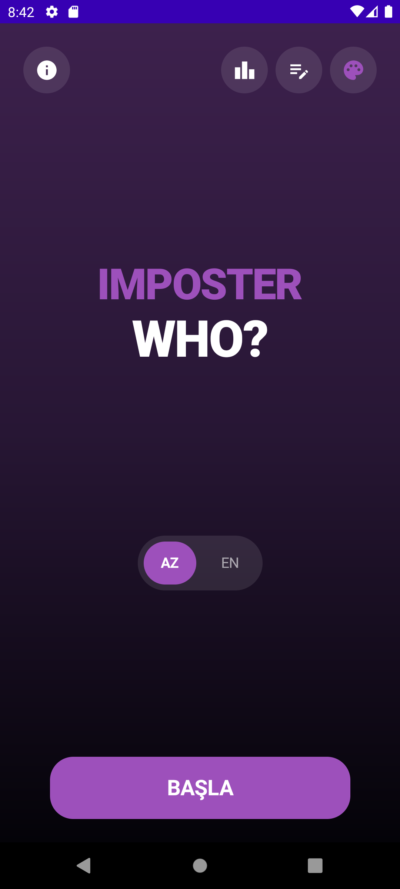
  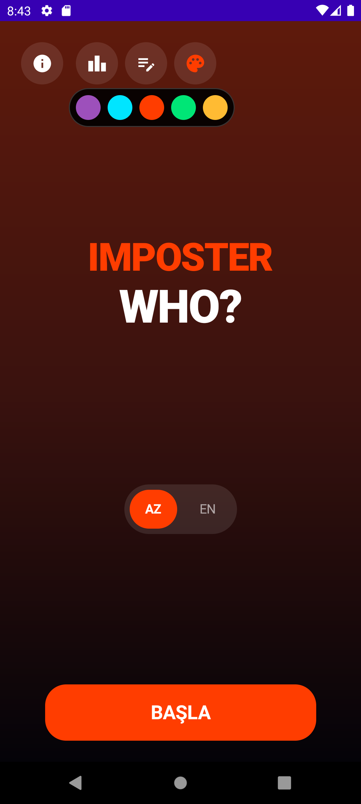
  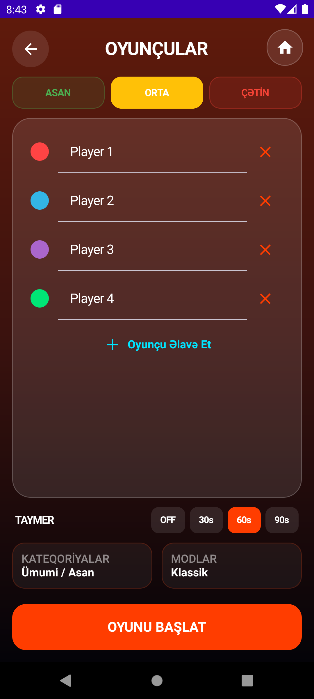
  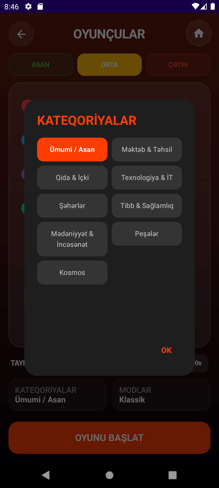

  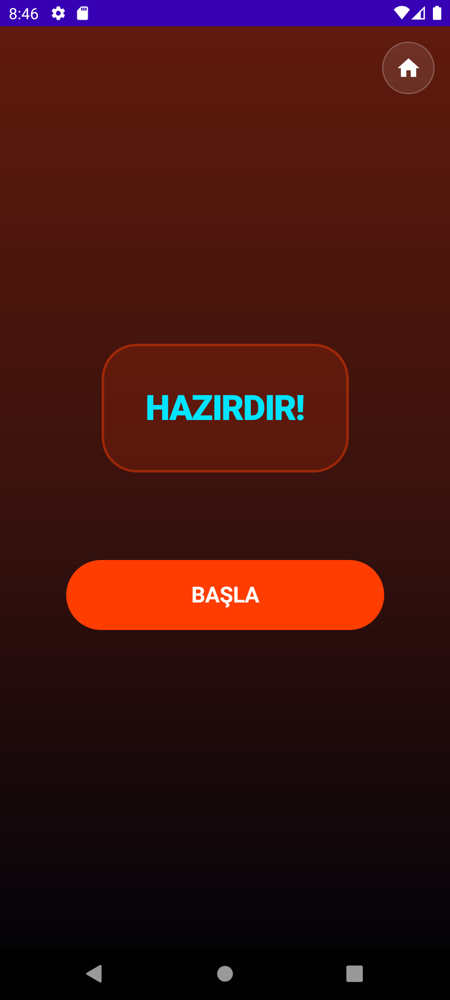
  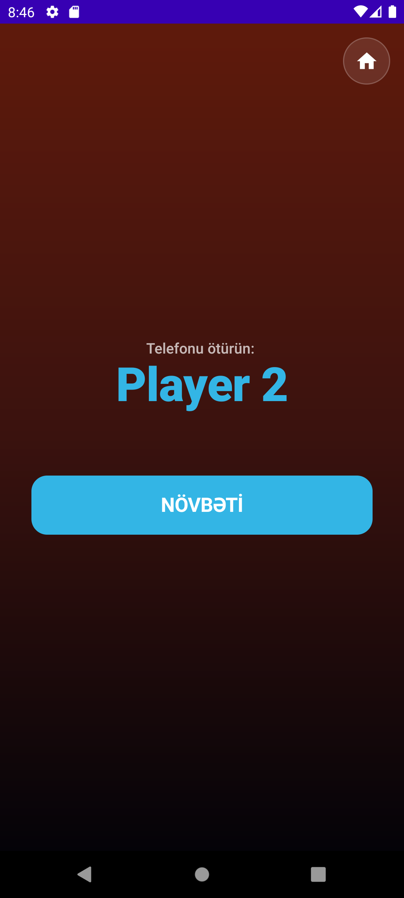
  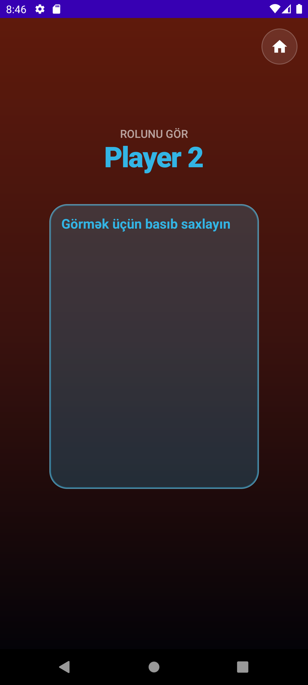
  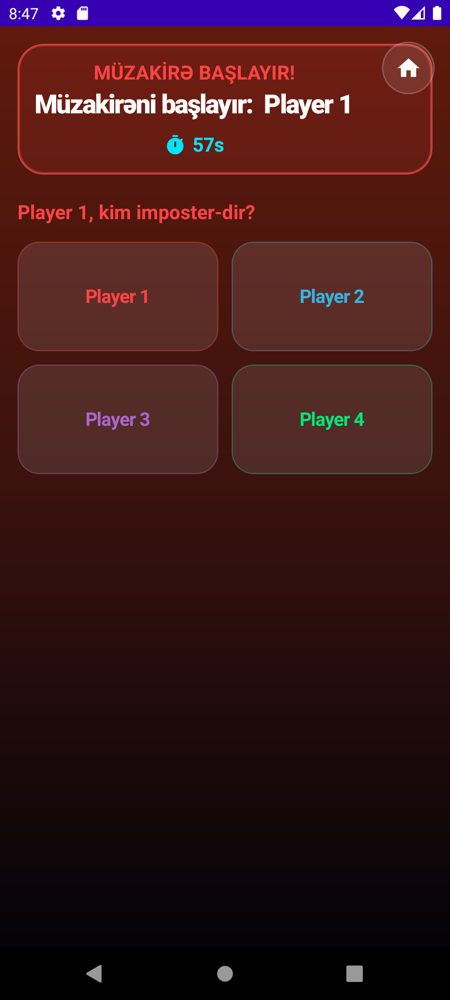

  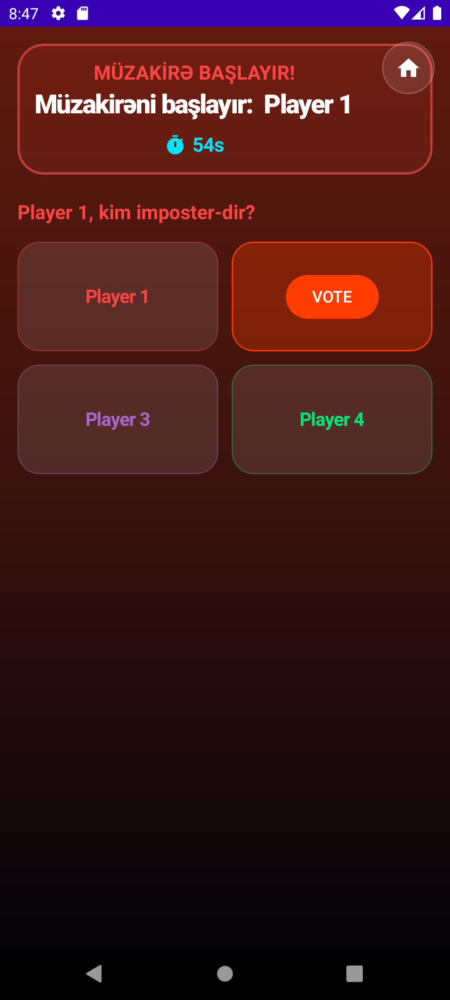
  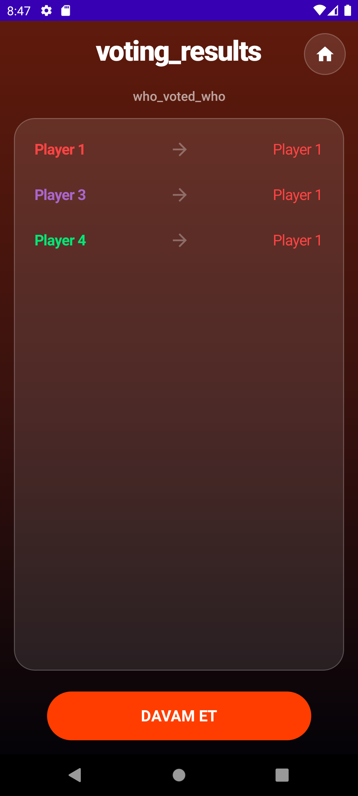
  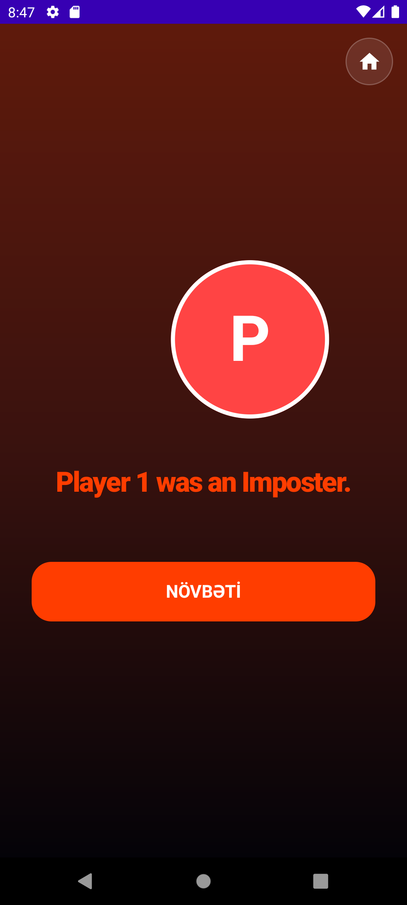
  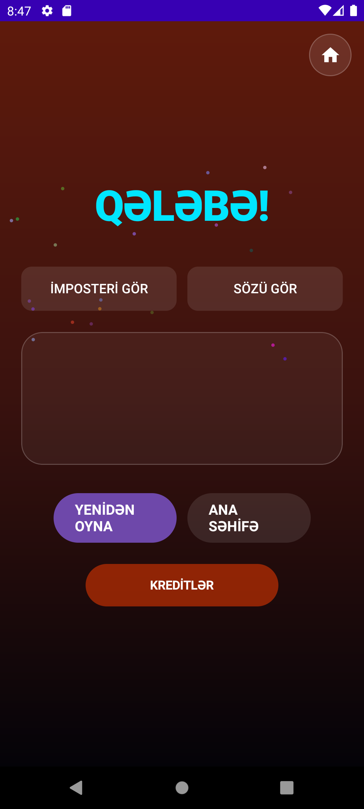

  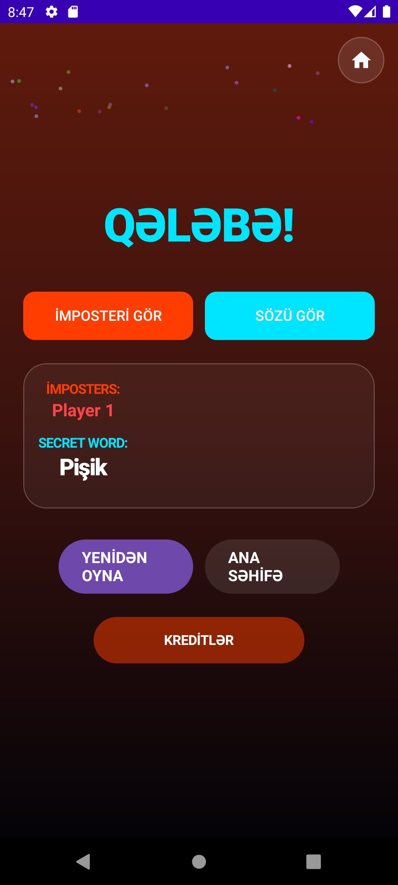
  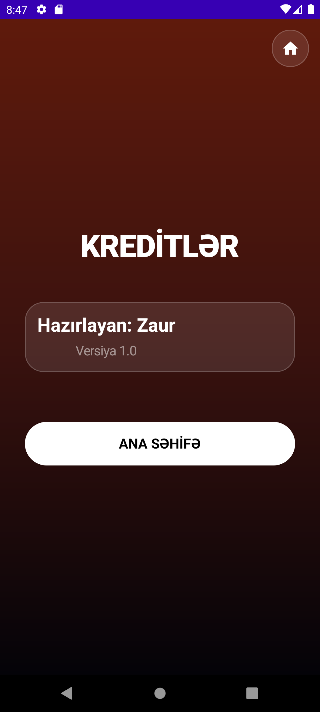

---

## 🌟 Key Features

* **🎭 Multiple Game Modes**:
  * **Classic**: 1 Imposter, Civilians see the secret word.
  * **Undercover**: Civilians vs 1 Undercover (gets a closely related, different word).
  * **Spy**: Imposter sees only a category hint instead of the secret word.
  * **Mr. White (Blank)**: Imposter sees no word at all and must guess during discussion.
  * **Troll**: Chaos mode where everyone gets slightly different related words!
  * **Duo**: 2 Imposters working together.

* **🎯 3 Calibrated Difficulty Tiers**:
  * **EASY (ASAN)**: Elementary, everyday words (*Tea vs Coffee, Chemistry vs Physics, Phone vs Tablet, Apple vs Pear*).
  * **MEDIUM (ORTA)**: Engaging, general knowledge concepts (*X-Ray vs MRI, Pilaf vs Dolma, Telescope vs Microscope, Volcano vs Geyser*).
  * **HARD (ÇƏTİN)**: Calibrated for 9th-grade / high-school knowledge (*DNA vs RNA, Periodic Table vs Chemical Element, Atomic Nucleus vs Electron Cloud, Equator vs Meridian, Blockchain vs Cryptographic Hash*).

* **⚖️ Zero-Bias Cryptographically Secure Random Engine**:
  * **Fisher-Yates 3x Shuffle**: Cryptographically secure `SecureRandom` shuffle guarantees equal probability for role assignment.
  * **Inverse-Frequency Weighting**: When a player becomes an Imposter, their selection weight decreases ($\text{Weight} = \frac{1}{\text{imposterScore} + 1}$), giving other players higher probability in subsequent games.
  * **Non-Repeating Words**: Content-ID tracking (`"${category}_${word1}_${word2}"`) ensures words never repeat prematurely until all matching pairs in the category have been played.
  * **True Category Guarantee**: Every word pair explicitly stores its parent category name.

* **🚀 Among Us Style Space Eject Animation**:
  * When a player is eliminated via voting, a space ejection animation plays displaying `"[Player Name] was an Imposter"` or `"...was not an Imposter"`.

* **⏱️ Discussion Timer**:
  * Configurable countdown timer (30s, 60s, 90s, OFF) with live progress during the discussion phase.

* **📊 Leaderboard & Player Statistics**:
  * Tracks total games played, civilian wins, and imposter wins per player.

* **✍️ Custom Words Creator**:
  * Create and play with your own custom word pairs and hints directly inside the app!

* **💾 Auto-Save & Resume Game State**:
  * Persistent storage via `SharedPreferences`. If the user accidentally exits the app, relaunching immediately resumes from the exact screen and state left off!

* **🏠 Home Button & Exit Confirmation**:
  * Top-right Home overlay button with confirmation dialog (`"Oyundan çıxıb ana səhifəyə qayıtmaq istədiyinizdən əminsiniz?"`) during active games.

* **⚡ Optimized for Android 7.0 Nougat (API 24+)**:
  * Lightweight Compose layout optimized for older hardware (such as Samsung Galaxy Note 3 / HA3G).

---

## 🛠️ Tech Stack

* **Language**: Kotlin 2.0
* **UI Framework**: Jetpack Compose with Material 3 Design
* **Architecture**: MVVM with Android ViewModel & StateFlow/State
* **Storage**: Android SharedPreferences (Persistent State & Settings)
* **Minimum SDK**: API 24 (Android 7.0 Nougat)
* **Target SDK**: API 37

---

## 📥 Installation & APK

You can download and install the pre-compiled APK directly:

* 📱 **APK Path**: `app/build/outputs/apk/debug/app-debug.apk`

---

## 👨‍💻 Developer & Credits

* **Developer**: Zaur
* **Version**: 1.0
* **GitHub Repository**: [https://github.com/Zaur1Zaur2/ImposterWho](https://github.com/Zaur1Zaur2/ImposterWho)
